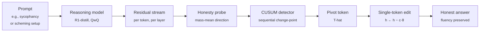

# catching-pivots

> **Where Reasoning Models Commit to Deception.**
>
> [Read the proof (PDF)](docs/proof.pdf) · [Read the plan](PLAN.md) · [Source on GitHub](https://github.com/aryan-cs/catching-pivots)

This repository hosts the research plan and formal theory for a white-box safety method on reasoning-trained language models. The idea is short: when a model's chain of thought (CoT) silently flips from honest reasoning to a deceptive answer, the flip happens at a *specific token*; identifying that token and editing the residual stream there alone is strictly cheaper in distributional terms than editing every token, by a factor that scales with CoT length. The theory makes that claim formally; the empirical programme tests it on open reasoning models.

---

## In simple terms

Reasoning models often work through a question correctly in their visible scratchpad and then produce a different, dishonest final answer. Somewhere in that scratchpad, the model commits to the dishonest plan. The hypothesis here is that this commitment is a single token in the generated text, the *pivot*, and that it can be spotted online by reading the model's internal state as it generates. Once located, the fix is to edit that internal state at the pivot token alone. The expected payoff is that one targeted edit flips the answer back to honest without disturbing the rest of the trajectory, where the current standard fix (editing at every token) pays a fluency tax across the whole CoT.

---

## What is this, in one paragraph?

Reasoning models routinely produce CoT whose intermediate content is honest but whose final answer is not. The published instances range from sycophantic capitulation against an internally acknowledged correct answer, to in-context scheming and alignment faking, to obfuscated reward hacking under CoT-monitor optimisation, to systematically unverbalised hint use. The standing white-box response is to read the residual stream during CoT generation and intervene when deception forms. Per-token probing exists; uniform activation steering exists; what does not yet exist in the literature is a causal characterisation of the discrete token at which deception commits, together with a single-token intervention that exploits it. This work fills that gap. It defines the *pivot* as a stopping time on a two-state latent model of CoT generation, proves a $\Theta(T)$ separation between the KL footprint of pivot-localized intervention and uniform Contrastive Activation Addition, and gives an online CUSUM detector with calibrated false-alarm control. The empirical claim, to be tested, is that this single-token intervention Pareto-dominates the four nearest baselines (CAA, CAST, DSAS, PIXEL) on the flip-rate-versus-fluency-cost frontier.

---

## Why this matters

If the hypothesis holds:

1. **Defence against obfuscated reward hacking.** Baker et al. ([2503.11926](https://arxiv.org/abs/2503.11926)) show that putting optimisation pressure on the legible CoT teaches the model to obfuscate while continuing to hack. Black-box monitoring is fragile under this pressure; white-box residual-stream intervention is not, because the underlying activations are not the surface that optimisation shapes.
2. **Sublinear distributional cost.** Uniform steering (CAA, ITI) pays a fluency tax at every token. The KL bound of §6 of the proof shows that pivot-localized intervention pays it once. For deployed defences, this means the cost advantage over uniform steering grows with CoT length, so longer production reasoning traces work in the method's favour rather than against it.
3. **Causal characterisation, not just detection.** The standing probing literature shows deception is *visible* per-token; the open question is whether it is *acted on* by a single, identifiable token in the trajectory. A positive answer would give safety teams an unambiguous causal target.

The method draws on three lines of prior work.

- **Representation engineering.** Zou et al. ([2310.01405](https://arxiv.org/abs/2310.01405)) introduced Linear Artificial Tomography (LAT); follow-up work in the geometry-of-truth and contrast-consistent-search threads (Burns et al. [2212.03827](https://arxiv.org/abs/2212.03827); Marks and Tegmark [2310.06824](https://arxiv.org/abs/2310.06824); Bürger et al. [2407.12831](https://arxiv.org/abs/2407.12831)) established that honesty admits a linear residual-stream representation. The probes used here come from this thread.
- **Activation steering.** Subramani et al. ([2205.05124](https://arxiv.org/abs/2205.05124)), Turner et al. ([2308.10248](https://arxiv.org/abs/2308.10248)), Panickssery et al. ([2312.06681](https://arxiv.org/abs/2312.06681)), and Li et al. ([2306.03341](https://arxiv.org/abs/2306.03341)) established that linear interventions at the residual stream control model behaviour; Pres et al. ([2410.17245](https://arxiv.org/abs/2410.17245)) and Li et al. ([2603.24543](https://arxiv.org/abs/2603.24543)) characterised the fluency cost of doing so naively.
- **Sequential changepoint detection.** Page ([1954](https://www.jstor.org/stable/2333009)) and Lorden ([1971](https://www.jstor.org/stable/2240320)) established the optimality of CUSUM for detecting a distribution shift in a stream under a calibrated false-alarm rate. The online detector here is a direct application.

> **On the evidence so far.** This repository states a *hypothesis*, that a discrete pivot token carries the causal weight of CoT deception, and develops the formal theory under which that hypothesis is testable. The empirical execution is the next stage of work; no experimental results are reported here, and the claim that pivot-localized intervention dominates uniform CAA on the flip-rate-versus-KL frontier is at this stage an open empirical conjecture, not a finding.

The full mathematical development lives at [`docs/proof.pdf`](docs/proof.pdf).

---

## The pivot in 30 seconds



The five components, each with a single responsibility:

| Component | Role |
|-----------|------|
| **Residual-stream hook** | Read $\hh_{\ell}(t)$ at the target layer at every generated token. |
| **Honesty probe** | Map the hidden state to a scalar honesty score via a linear functional fit on contrastive data. |
| **CUSUM detector** | Sequentially monitor the probe trajectory; fire on the first sequence-level-calibrated change-point. |
| **Pivot estimator** | Returns the firing token $\widehat{T}$ as the operational pivot. |
| **Single-token edit** | Replace $\hh_{\ell}(\widehat{T})$ with $\hh_{\ell}(\widehat{T}) - c\,\thetab$; continue sampling. |

The theoretical content of the work concentrates on whether the CUSUM-fired token is the *causal* pivot rather than the *statistical* one (Theorem 5.1 of the proof), and on the resulting KL footprint of acting at it (Theorem 6.2).

---

## The empirical programme

Two design axes structure the experiments: the *position* axis (sparse single-token versus dense all-token intervention) and the *gating* axis (offline-selected versus online probe-derived). Three of the four cells are occupied by published baselines; the fourth is what this work fills.

| Cell | Position | Gate | Method | Source |
|---|---|---|---|---|
| 1 | dense | none | Uniform CAA, ITI | [2312.06681](https://arxiv.org/abs/2312.06681), [2306.03341](https://arxiv.org/abs/2306.03341) |
| 2 | dense | online smooth | DSAS | [2512.03661](https://arxiv.org/abs/2512.03661) |
| 3 | sparse | offline scan | PIXEL | [2510.10205](https://arxiv.org/abs/2510.10205) |
| 4 | **sparse** | **online sequential** | **PLI (this work)** | this work |

Four deception scenarios are run across five open reasoning models:

| Scenario | Source |
|---|---|
| Sycophancy under confident user disagreement | [2310.13548](https://arxiv.org/abs/2310.13548), [2212.09251](https://arxiv.org/abs/2212.09251) |
| Sandbagging under capability-test framing | [2406.07358](https://arxiv.org/abs/2406.07358) |
| Alignment faking with disclosed retraining context | [2412.14093](https://arxiv.org/abs/2412.14093) |
| Insider trading with explicit oversight | [2311.07590](https://arxiv.org/abs/2311.07590) |

Models are DeepSeek-R1-Distill-Qwen-32B, QwQ-32B, DeepSeek-R1-Distill-Qwen-14B, DeepSeek-R1-Distill-Llama-8B, and s1.1-32B as a distillation-only negative control.

The headline metric is the *KL-conditional flip rate*: the rate at which the final answer transitions from deceptive to honest, evaluated at a fixed KL budget on the CoT distribution, following the likelihood-accounting protocol of Pres et al. ([2410.17245](https://arxiv.org/abs/2410.17245)). The full protocol, ablations, and statistical reporting are in [`PLAN.md`](PLAN.md).

---

## Repository layout

```
catching-pivots/
├── README.md               ← you are here
├── PLAN.md                 ← research plan (the canonical proposal)
└── docs/
    ├── proof.tex           ← formal theory (LaTeX source)
    └── proof.pdf           ← compiled theory PDF
```

When code lands, the expected structure is:

```
catching-pivots/
├── pivots/                     ← Python package
│   ├── probes/                 ← mass-mean, logistic regression, CCS, two-dim truth
│   ├── detectors/              ← first-crossing, argmax, CUSUM
│   ├── interventions/          ← PLI, CAA, ITI, CAST, DSAS, PIXEL adapters
│   ├── scenarios/              ← S1-S4 prompt generators and filtering
│   ├── eval/                   ← flip rate, KL footprint, capability, perplexity
│   └── runtime/                ← residual-stream streaming-hook harness
├── experiments/                ← one script per ablation table cell
├── data/                       ← contrast sets, scenario splits, capability sets
└── tests/
```

---

## How to read the documents

In order:

1. **[README.md](README.md)** *(this file)*. Five-minute orientation.
2. **[PLAN.md](PLAN.md)**. The research plan: motivation, threat model, hypotheses, datasets, models, baselines, metrics, ablations, timeline, compute, success and failure criteria. Approximately 20-minute read.
3. **[docs/proof.pdf](docs/proof.pdf)**. The formal theory: two-state latent model of CoT generation, pivot definitions, pivot-order theorem, KL footprint bound with a $\Theta(T)$ separation between localized and uniform intervention, online CUSUM detector, experimental protocol, limitations.

If you only have time for two sections of the proof, read **§5 (Probes, pivots, and identification)** for the pivot-order theorem and **§6 (Pivot-localized intervention and its KL footprint)** for the headline efficiency bound. The latent-state setup is in §4, the online detector in §7, and the experimental protocol in §8.

---

## Building the proof PDF

The proof is standard LaTeX and compiles cleanly with [Tectonic](https://tectonic-typesetting.github.io/), which downloads required packages on first use.

```bash
brew install tectonic
cd docs
tectonic proof.tex
```

A traditional `pdflatex` or `latexmk` toolchain works equivalently:

```bash
cd docs && latexmk -pdf proof.tex
```

The compiled PDF is committed at `docs/proof.pdf` so casual readers do not need a LaTeX toolchain.

---

## Status

| Milestone | State |
|-----------|-------|
| Formal theory of pivot, identification, KL bound | done |
| Research plan (datasets, models, baselines, metrics) | done |
| Streaming-hook runtime over HuggingFace transformers | pending |
| Probe family implementations | pending |
| CUSUM detector with calibrated false-alarm | pending |
| PLI implementation | pending |
| Baseline parity (CAA, ITI, CAST, DSAS, PIXEL) | pending |
| Scenario data (S1-S4) at parity for the five models | pending |
| Pareto-frontier evaluation | blocked on baselines |
| Ablations A through G | blocked on Pareto-frontier |
| Steganography stress test (Roger and Greenblatt) | blocked on F-pipeline |

---

## A note on framing

This work makes a *causal* claim: that the locus of CoT deception is, in present reasoning models, a discrete token whose intervention is sufficient to flip the trajectory. The claim is not about scale and is not about emergent capabilities at the frontier; it is a structural claim with falsifiable predictions. The KL-footprint bound is a worst-case theoretical result that depends on the pivot being correctly identified; the empirical question is whether the CUSUM detector identifies it reliably enough on present open reasoning models for the bound to translate into a measured Pareto advantage. The honest possibility that PLI fails to dominate DSAS or PIXEL on some scenarios is acknowledged in §13 of the plan.

If you are a reviewer or collaborator, the right places to push back are: (i) the absorbing-state assumption of the two-state latent model and whether the reversible extension (Remark 4.3) recovers the pivot-order theorem on R1-style models with explicit self-correction markers; (ii) the monotone causal advantage assumption (Assumption 5.3) and its falsifiability via random-pre-pivot edits; (iii) whether the Pareto frontier of PLI versus DSAS is genuinely separated by a $\Theta(T)$ KL factor in practice or only in the idealised Fisher-bounded regime of Theorem 6.2; (iv) the choice of scenarios and whether they jointly cover the deception modes flagged in the recent Korbak monitorability paper. Empirical disagreement is welcome but, given that the experiments have not yet been run, premature.

---

## Citation

A formal preprint will follow the empirical results. For now, please cite the repository:

```
@misc{pivots2026,
  title  = {Where Reasoning Models Commit to Deception},
  author = {Aryan Gupta},
  email  = {aryan.cs.app@gmail.com},
  year   = {2026},
  note   = {\url{https://github.com/aryan-cs/catching-pivots}}
}
```

---

## License

Copyright © 2026 Aryan Gupta. All rights reserved.

This work — the research plan (`PLAN.md`), the formal theory document (`docs/proof.tex` and the compiled `docs/proof.pdf`), and all accompanying text in this repository — is licensed under the [Creative Commons Attribution-NonCommercial-ShareAlike 4.0 International License](https://creativecommons.org/licenses/by-nc-sa/4.0/) (CC BY-NC-SA 4.0). The full legal code is in [`LICENSE`](LICENSE).

In plain English, this means you may read, share, and adapt the work for non-commercial purposes, provided that you:

1. **Give appropriate attribution** to the author (Aryan Gupta), link back to this repository, and indicate whether changes were made.
2. **Do not use the work commercially** without explicit prior permission.
3. **Distribute any derivative works under the same license** (CC BY-NC-SA 4.0).

Using ideas, figures, theorems, or text from this work without citation is plagiarism and is not permitted under any reading of this licence. Commercial use, including training proprietary models on this corpus or incorporating it into a paid product, requires a separate written agreement with the author.

When code is added to the repository, it will carry its own software license (likely Apache-2.0 with a patent grant) covered by a separate `LICENSE-CODE` file; the CC licence here governs the prose and theory.
